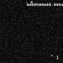

A time-stamper plugin for ImageJ/Fiji
=====================================

This plugin is intended for stacks with a temporal dimension (2D+T, 3D+T, etc.).
Frames in the time series will be decorated with a timestamp and, optionally, a progressing bar.

Here's a demo with the *Tracks for TrackMate* sample:

The plugin's menu entry is next to the Scalebar entry: `Analyze > Tools > Time Bar...`. The configuration window that opens lets the user chose a few options:

- [x] The progress bar can be disabled
- [x] The time units can be replaced by symbols (ie: `D-HH:MM:ss.SSS`)
- [x] The time format can be modified (`D-HH:MM:ss.SSS` or `D-HH:MM` or `HH:MM:ss` or `ss.SSS` and many more!)

And just like the scale bar :

- [x] The progress bar thickness can be changed
- [x] The font can be made Bold or Serif, the font size can be changed
- [x] The location can be modified (all four corners, or at the selection)
- [x] Font and background color can be changed

The frame interval information is extracted from the image's metadata (`Image > Properties... > Frame interval`). Units in this field can be one of `h/hr/hrs/hour/hours` for hours, `m/min/minute/minutes` for minutes, `s/sec/second/seconds` for seconds, `ms/milisecond/miliseconds` for miliseconds.
